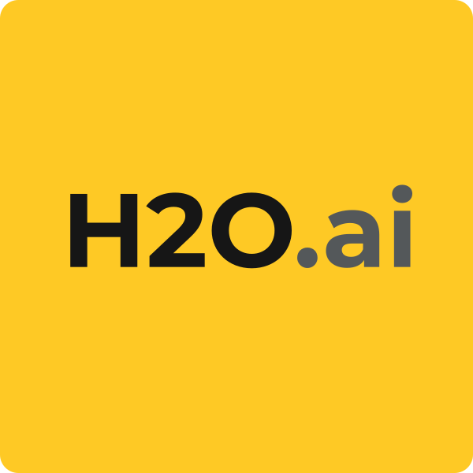

# Riot Support Agent — h2oGPTe Helpdesk Assistant

<p align="center">
  <a href="https://en.wikipedia.org/wiki/Riot_Games#/media/File:Riot_Games_2022.svg">
    
  </a>
  &nbsp;&nbsp;&nbsp;&nbsp;
  <a href="https://docs.h2o.ai/">
    
  </a>
</p>

Agente de IA que asiste a los agentes humanos de soporte de Riot Games a responder tickets más rápido usando **Enterprise h2oGPTe** con RAG, Function Calling y Routing.

Se ejecuta **en producción** en [H2O AI Cloud](https://partners.h2o.ai/home) → Enterprise h2oGPTe (`https://h2ogpte.partners.h2o.ai`). Classify, RAG (Collections) y Function Calling (Local MCP) corren ahí. El humano trabaja en **h2oGPTe Chat**.

---

## Caso de uso

### El problema real (sin IA)

Los agentes humanos de soporte siguen este flujo hoy para cada ticket:

| # | Paso | Tiempo invertido |
|---|---|---|
| 1 | Recibe el ticket del jugador | — |
| 2 | Lee y entiende el problema | Alto |
| 3 | Busca manualmente en la base de conocimiento | Alto |
| 4 | Redacta la respuesta desde cero | Alto |
| 5 | Decide si escalar o cerrar | Medio |

### Lo que resuelve nuestro agente

| Paso | Sin IA | Con el agente |
|---|---|---|
| Entender el ticket | El humano lo lee completo | El agente lo clasifica y resume en segundos |
| Buscar solución | Búsqueda manual en docs | RAG sobre la base de conocimiento de Riot |
| Redactar respuesta | Desde cero | El agente propone un borrador listo para editar |
| Decidir si escalar | Intuición del agente | El agente sugiere escalar o cerrar con razón explícita |

> **El agente humano mantiene el control final — el LLM hace el trabajo pesado.**

---

## Arquitectura

```
Ticket en h2oGPTe Chat
           │
           ▼
┌──────────────────────┐
│  Custom Agent        │  LangGraph
│  riot_helpdesk_agent │
│                      │  classify → route → retrieve_* → tools → draft
└──────────┬───────────┘
           │
     ┌─────┴──────┐
     ▼     ▼      ▼
 penal.  técnica  billing     ← 3 Collections RAG
     └─────┬──────┘
           ▼
  MCP riot-player-context     ← Function Calling
           ▼
  Borrador + close|escalate
           ▼
  Agente humano revisa y envía
```

---

## Conceptos del curso aplicados

| Concepto | Rol en este proyecto |
|---|---|
| **LLM Chains** | Nodo `classify`: ticket → categoría + resumen |
| **Routing** | Nodo `route` + aristas condicionales a 3 ramas |
| **Function Calling** | MCP `get_account_status`, `get_ban_reason`, `get_ticket_history`, `get_purchase_history` |
| **LLM Agents** | Custom Agent LangGraph en Chat (multi-turno) |
| **Benchmarking AI Assistants** | `src/benchmark/eval.py` vs tickets gold |
| **h2oGPTe Agents** | ZIP en Agents > Agents (`framework: langgraph`) |

---

## Routing — Las 3 ramas

```
¿Ban o penalización?     → penalizaciones
¿Vanguard o técnico?     → tecnica
¿Compras / reembolsos?   → billing
```

Cada rama tiene su Collection RAG y un subset de tools MCP.

---

## Modelo de datos — 3 capas

### Capa 1 — Base de conocimiento (RAG)

Artículos del centro de soporte (Zendesk Help Center API pública) más samples en el repo.

**Fuente:** `https://support.riotgames.com/api/v2/help_center/{locale}/articles.json`

```
data/knowledge_base/
  vanguard_errors/
  bans_penalties/
  account_support/
  purchases/
  technical/
```

Collections en h2oGPTe: `riot-support-penalizaciones`, `riot-support-tecnica`, `riot-support-billing`.

### Capa 2 — Tickets históricos (few-shot / evaluación)

```
data/tickets/synthetic_tickets.jsonl
data/tickets/ticket_schema.json
```

### Capa 3 — Contexto del jugador (Function Calling)

APIs simuladas en el Local MCP `packages/riot_player_context/` (`players.json` fake, sin PII real).

---

## Estructura del proyecto

```
quickstart-h2oGPTe/
├── README.md
├── .env.example
├── pyproject.toml
├── packages/
│   ├── riot_player_context/     ← Local MCP (ZIP)
│   └── riot_helpdesk_agent/     ← Custom Agent LangGraph (ZIP)
├── src/ingestion/               ← scraper, tickets, ingest collections
├── src/benchmark/eval.py
├── notebooks/01_exploration.ipynb
└── scripts/pack.sh
```

---

## Inicio rápido — producción en partners.h2o.ai

```bash
git clone https://github.com/Motivus-AI/quickstart-h2oGPTe.git
cd quickstart-h2oGPTe

python -m venv .venv
source .venv/bin/activate
pip install -e ".[dev]"

cp .env.example .env
# H2OGPTE_ADDRESS ya apunta a https://h2ogpte.partners.h2o.ai
# Crear API key en Enterprise h2oGPTe → pegar en H2OGPTE_API_KEY

python src/ingestion/ticket_generator.py
python src/deploy_partners.py
```

Eso empaqueta los ZIP, crea/actualiza las 3 Collections RAG y sube el Local MCP + Custom Agent LangGraph al tenant de partners.

Luego: [partners.h2o.ai](https://partners.h2o.ai/home) → Enterprise h2oGPTe → **Chat** → Agent Type = `riot_helpdesk_agent`.

```
VAN 57 error al iniciar Valorant. player_id=abc123
```

Si el agente no queda Ready: Assign Keys (`CUSTOM_AGENT_API_KEY`, `CUSTOM_AGENT_BASE_URL=https://h2ogpte.partners.h2o.ai`) y Assign Tools (`riot-player-context`).

Eval contra el cloud:

```bash
python src/benchmark/eval.py --production
```

Tests offline (sin llamar a partners):

```bash
H2OGPTE_OFFLINE=1 pytest -q
```

Cliente: [h2ogpte Python](https://h2oai.github.io/h2ogpte/).

---

## Deploy en H2O AI Cloud

Todo el runtime es [partners.h2o.ai](https://partners.h2o.ai/home). No hay Azure, GCP ni AWS.

| Paso | Qué corre en partners |
|---|---|
| Collections | `riot-support-penalizaciones`, `tecnica`, `billing` |
| Local MCP | `riot-player-context` |
| Custom Agent | `riot_helpdesk_agent` (`agent_type=langgraph`) |
| Chat | El agente humano pega el ticket y revisa el borrador |

```bash
python src/deploy_partners.py              # ingest + upload
python src/deploy_partners.py --skip-ingest
python src/ingestion/zendesk_scraper.py    # opcional, más artículos
python src/ingestion/ingest_collections.py # re-ingesta KB
```

Guías: [custom agent manual](https://docs.h2o.ai/enterprise-h2ogpte/guide/agents/custom-agents/manual-custom-agent-creation), [MCP + agent](https://docs.h2o.ai/enterprise-h2ogpte/guide/agents/custom-agents/create-local-mcp-tool-with-tool-builder).

---

## Referencias

- [H2O AI Cloud (partners)](https://partners.h2o.ai/home)
- [h2oGPTe Python client](https://h2oai.github.io/h2ogpte/)
- [Enterprise h2oGPTe docs](https://docs.h2o.ai/enterprise-h2ogpte)
- [Riot Games Support](https://support.riotgames.com/en-us/riot/)
- [Zendesk Help Center API](https://developer.zendesk.com/api-reference/help_center/help-center-api/articles/)
